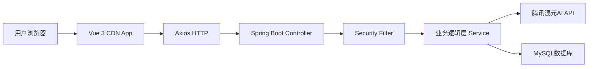

## Product Overview

基于Spring Boot后端与Vue CDN前端架构的AI图片/视频生成平台，提供文生图、图生图、批量抠图及模特换脸等核心AI创作功能。

## Core Features

- **用户认证**：集成Spring Security与微信扫码登录
- **文生图模块**：输入文本描述生成图片
- **图生图模块**：上传图片基于参考图生成新图
- **批量抠图**：支持多图片智能去底
- **智能换脸**：模特换脸及背景瑕疵细节处理模板
- **任务管理**：生成历史记录与状态追踪

## Tech Stack

- **前端框架**：Vue 3 (CDN引入，无Node.js)
- **后端框架**：Spring Boot + Java
- **安全框架**：Spring Security
- **数据库**：MySQL
- **AI服务**：腾讯混元AI API
- **UI组件库**：Element Plus (CDN)

## Tech Architecture

### 系统架构

采用前后端分离架构，前端通过CDN引入Vue，后端提供RESTful API。前端直接通过Axios调用Spring Boot接口，无需构建工具。



### 模块划分

- **前端模块**：基于Vue 3的CDN应用，包含路由、状态管理、页面组件
- **认证模块**：Spring Security + JWT + 微信OAuth2
- **AI服务模块**：封装腾讯混元API调用（文生图、图生图、抠图、换脸）
- **任务管理模块**：异步任务处理与状态追踪

### 数据流

用户操作 -> Vue组件 -> Axios请求 -> Spring Security鉴权 -> Controller -> Service -> AI API/DB -> 响应返回 -> 前端更新视图

## 实现细节

### 核心目录结构

```
project-root/
├── src/main/java/com/neoaigc/
│   ├── controller/      # REST API控制器
│   ├── service/         # 业务逻辑层
│   ├── security/        # Spring Security配置
│   ├── config/          # AI API配置
│   └── entity/          # 数据库实体
├── src/main/resources/
│   ├── application.yml  # 配置文件
│   └── static/          # 静态资源（可选）
└── frontend/            # 新增：前端CDN资源目录
    ├── index.html       # 单页入口
    ├── js/
    │   ├── app.js       # Vue应用主入口
    │   ├── api.js       # API封装
    │   └── components/  # 组件定义
    └── css/             # 样式文件
```

### 关键代码结构

**AI任务实体**：定义AI生成任务的数据结构，包含任务类型、参数、状态和结果。

```java
@Entity
public class AiTask {
    private Long id;
    private String userId;
    private TaskType type; // TEXT_TO_IMAGE, IMAGE_TO_IMAGE, etc.
    private String prompt;
    private String imageUrl;
    private TaskStatus status; // PENDING, PROCESSING, COMPLETED, FAILED
    private LocalDateTime createdAt;
}
```

**腾讯混元服务接口**：封装AI API调用的核心接口。

```java
public interface TencentHunyuanService {
    String textToImage(String prompt, ImageStyle style);
    String imageToImage(String imageUrl, String prompt);
    String removeBackground(List<String> imageUrls);
    String faceSwap(String targetImage, String sourceImage);
}
```

### 技术实施计划

**1. 无Node.js前端构建**

- 问题：如何在不使用Node.js的情况下构建Vue应用
- 方案：使用Vue 3 Global Build CDN版本，通过script标签引入
- 关键技术：Vue 3 Composition API, Element Plus CDN, Axios
- 实施步骤：

1. 创建index.html作为单页入口
2. 引入Vue、Element Plus、Axios的CDN链接
3. 使用ES Modules或全局变量方式组织代码
4. 实现前端路由（基于hash或history API）

- 测试策略：浏览器直接打开HTML文件验证功能

**2. Spring Security微信登录集成**

- 问题：集成微信OAuth2扫码登录
- 方案：自定义Security Filter处理微信回调
- 关键技术：OAuth2, JWT, Redis
- 实施步骤：

1. 配置微信开放平台AppID和Secret
2. 实现微信OAuth2授权流程
3. 生成JWT Token并返回前端
4. 配置Security拦截规则

- 测试策略：模拟微信回调接口验证登录流程

### 集成点

- **前后端通信**：JSON格式通过RESTful API
- **第三方服务**：腾讯混元AI API（需配置API密钥）
- **存储服务**：MySQL存储用户数据和任务记录
- **认证授权**：JWT Token存储在LocalStorage或Cookie

## 技术考虑

### 性能优化

- 前端资源使用CDN加速
- 图片上传使用压缩处理
- AI任务采用异步队列处理
- 前端实现懒加载和分页

### 安全措施

- Spring Security配置CORS策略
- API请求签名验证
- 敏感信息加密存储
- 输入参数校验与XSS防护

### 可扩展性

- AI服务接口抽象，便于切换供应商
- 模块化设计，便于新增AI功能模板
- 任务队列支持横向扩展

## 设计风格

采用现代科技感设计，使用深色模式搭配霓虹色调，体现AI产品的科技属性。布局采用响应式设计，左侧为功能导航，右侧为操作区域。使用Vue 3 CDN + Element Plus构建，无需Node.js环境。

## 页面规划

1. **登录页**：微信扫码登录界面，简洁大气
2. **工作台首页**：展示功能入口、历史任务概览
3. **文生图页面**：文本输入框、参数调节、生成结果展示
4. **图生图页面**：图片上传、参考图选择、生成结果
5. **批量抠图页面**：多图拖拽上传、进度条、结果下载
6. **智能换脸页面**：模特图上传、目标脸选择、背景处理选项

## 单页块设计

- **顶部导航栏**：Logo、用户信息、通知入口
- **功能侧边栏**：图标+文字导航，支持展开收起
- **主内容区**：分块布局，操作区在上，结果区在下
- **任务列表**：表格展示历史记录，支持筛选和重试

## Agent Extensions

### Skill

- **skill-creator**
- 目的：指导创建AI功能相关的Skill扩展
- 预期结果：构建可复用的AI生成技能模块

### MCP

- **MCP Server Playwright**
- 目的：用于前端页面UI测试和自动化验证
- 预期结果：确保CDN前端页面在各种浏览器中正常运行

### SubAgent

- **code-explorer**
- 目的：探索现有Spring Boot后端代码结构
- 预期结果：理解现有API接口，便于前端对接