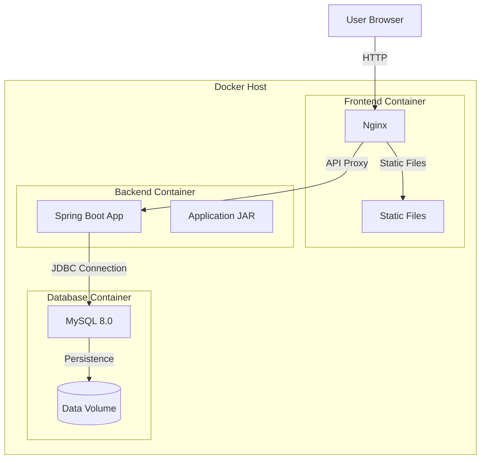
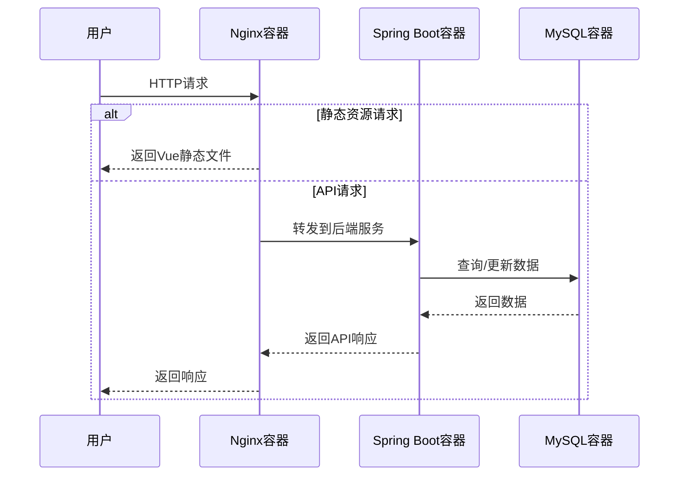

## 产品概述

为NeoAI GC项目构建完整的Docker容器化部署方案，实现Spring Boot后端、Vue3前端和MySQL数据库的一键部署。

## 核心功能

- Spring Boot后端容器化配置
- Vue3前端容器化配置
- MySQL数据库服务编排
- Nginx反向代理配置
- 环境变量集中管理
- 多阶段构建优化镜像体积
- 服务间网络隔离与通信

## 技术栈

- 容器化：Docker + Docker Compose
- Web服务器：Nginx
- 数据库：MySQL 8.0
- 后端：Spring Boot（JDK 17/21）
- 前端：Vue3 + Vite

## 技术架构

### 系统架构

采用Docker Compose多服务编排架构，通过独立容器隔离各组件，使用自定义网络实现服务间通信。



### 模块划分

- **前端容器模块**
- 负责Vue3应用构建和静态资源托管
- 使用多阶段构建：构建阶段基于Node.js，运行阶段基于Nginx Alpine
- 暴露80端口对外服务
- 依赖：无外部服务依赖

- **后端容器模块**
- 负责Spring Boot应用运行
- 基于OpenJDK镜像，优化启动参数
- 配置健康检查端点
- 依赖：MySQL数据库服务

- **数据库服务模块**
- 提供MySQL 8.0数据存储服务
- 持久化数据卷映射
- 初始化脚本支持
- 依赖：无外部服务依赖

### 数据流



## 实现细节

### 核心目录结构

```
neoaigc/
├── docker/
│   ├── nginx/
│   │   └── default.conf          # Nginx配置文件
│   ├── mysql/
│   │   └── init.sql               # 数据库初始化脚本
│   ├── frontend/
│   │   ├── Dockerfile             # Vue3前端Dockerfile
│   │   └── nginx.conf             # 前端Nginx配置
│   └── backend/
│       └── Dockerfile             # Spring Boot后端Dockerfile
├── docker-compose.yml            # Docker Compose编排文件
└── .env                          # 环境变量配置文件
```

### 关键代码结构

**Docker Compose服务定义**：

```
services:
  mysql:
    image: mysql:8.0
    environment:
      MYSQL_ROOT_PASSWORD: ${MYSQL_ROOT_PASSWORD}
      MYSQL_DATABASE: ${MYSQL_DATABASE}
    volumes:
      - mysql-data:/var/lib/mysql
      - ./docker/mysql/init.sql:/docker-entrypoint-initdb.d/init.sql

  backend:
    build:
      context: ./docker/backend
    environment:
      SPRING_DATASOURCE_URL: jdbc:mysql://mysql:3306/${MYSQL_DATABASE}
    depends_on:
      - mysql

  frontend:
    build:
      context: ./docker/frontend
    ports:
      - "80:80"
    depends_on:
      - backend

volumes:
  mysql-data:
```

**环境变量配置**：

```
# 数据库配置
MYSQL_ROOT_PASSWORD=root_password
MYSQL_DATABASE=neoaigc
MYSQL_USER=neoaigc_user
MYSQL_PASSWORD=neoaigc_pass

# 后端配置
SPRING_PROFILES_ACTIVE=prod
SERVER_PORT=8080

# 前端配置
VITE_API_BASE_URL=http://backend:8080/api
```

### 技术实施计划

1. **前端容器化**

- 问题：Vue3应用需要构建后由Nginx托管
- 方案：多阶段构建，第一阶段使用Node.js构建，第二阶段使用Nginx托管
- 关键技术：多阶段构建、Nginx配置、静态资源优化
- 实施步骤：创建前端Dockerfile，配置Nginx，构建测试镜像
- 测试策略：验证静态资源访问、路由配置、API代理

2. **后端容器化**

- 问题：Spring Boot应用需要连接MySQL数据库
- 方案：基于OpenJDK镜像，配置健康检查和启动优化
- 关键技术：JVM参数调优、健康检查、依赖等待
- 实施步骤：创建后端Dockerfile，配置环境变量，实现启动脚本
- 测试策略：验证应用启动、数据库连接、API响应

3. **服务编排与网络**

- 问题：需要协调多个容器服务和网络通信
- 方案：使用Docker Compose编排，配置自定义网络和服务发现
- 关键技术：Docker Compose、服务依赖、数据卷、环境变量注入
- 实施步骤：编写docker-compose.yml，配置服务依赖，设置数据持久化
- 测试策略：一键启动所有服务，验证服务间通信，测试数据持久化

### 集成点

- **前后端集成**：通过Nginx反向代理前端API请求到后端服务
- **数据持久化**：MySQL数据通过Docker volume映射到宿主机
- **环境配置**：通过.env文件统一管理所有环境变量
- **网络通信**：使用Docker自定义网络，服务间通过服务名通信

## 技术考量

### 日志管理

- 后端日志输出到标准输出，支持Docker日志收集
- Nginx访问日志和错误日志输出到标准输出
- 使用日志驱动配置日志轮转策略

### 性能优化

- 前端使用多阶段构建，减小最终镜像体积
- 后端配置JVM参数优化内存使用
- Nginx启用gzip压缩静态资源
- 使用.dockerignore排除不必要文件

### 安全措施

- 数据库密码通过环境变量注入，不硬编码
- 仅暴露必要端口（80对外，其他仅内部网络）
- 使用非root用户运行应用
- 敏感配置通过.env管理，不提交到版本控制

### 可扩展性

- 支持通过docker-compose scale扩展后端服务实例
- 数据库可独立升级和迁移
- 配置支持多环境切换（dev/test/prod）

## 设计风格

采用现代简约风格，以技术文档的专业性和可读性为核心。设计重点在于清晰的结构层次、良好的代码展示和直观的架构图表达。使用等宽字体展示代码，使用图表可视化系统架构和数据流。

## 页面规划

无需创建UI界面，本任务为后端部署配置方案设计。

## Agent Extensions

### SubAgent

- **code-explorer**
- 目的：探索NeoAI GC项目的现有结构，了解前后端项目配置、依赖文件和构建方式
- 预期结果：获取项目结构信息，确定构建命令、入口文件、配置文件位置，为编写Dockerfile提供依据