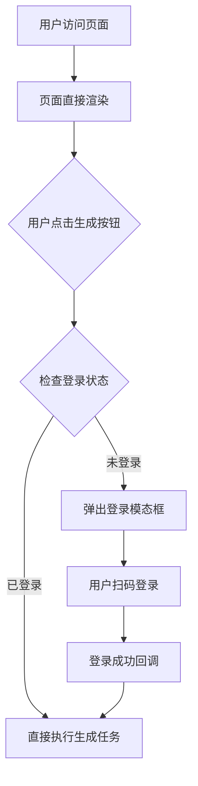

## 产品概述

将前端应用从"强制登录"改为"懒加载登录"模式，允许用户无需登录即可浏览和使用所有功能，仅在触发AI生成服务时进行身份验证。

## 核心功能

- 移除强制登录守卫，允许游客模式访问所有页面
- 保留登录逻辑，将其转换为模态框形式
- 在生成按钮点击时拦截并检查登录状态
- 未登录时弹出登录模态框
- 登录成功后自动提交生成任务
- 全局状态管理登录状态

## 技术栈

- 前端框架：React + TypeScript
- 状态管理：Context API 或 Zustand
- UI组件库：现有的模态框组件

## 架构设计

### 系统架构

采用"页面自由访问 + 功能级守卫"的架构模式。路由层不再包含登录守卫，业务逻辑层在需要鉴权的操作点进行拦截。



### 模块划分

- **路由模块**：移除登录守卫，开放所有路由
- **认证模块**：封装登录模态框组件和认证逻辑
- **状态管理模块**：管理全局登录状态和用户信息
- **业务模块**：生成按钮组件，集成登录检查逻辑

### 数据流

用户操作 → 生成按钮点击事件 → 检查AuthContext状态 → 条件分支（已登录/未登录）→ 执行任务或显示模态框 → 登录回调 → 执行任务

## 实现细节

### 核心目录结构

```
project-root/
├── src/
│   ├── components/
│   │   ├── GenerateButton.tsx      # 修改：添加登录检查逻辑
│   │   └── LoginModal.tsx          # 新增：登录模态框组件
│   ├── contexts/
│   │   └── AuthContext.tsx         # 新增/修改：认证状态管理
│   ├── guards/
│   │   └── AuthGuard.tsx           # 删除：移除路由守卫
│   └── pages/
│       └── Login.tsx               # 删除：移除独立登录页
```

### 关键代码结构

**登录状态接口**：定义全局认证状态的数据结构。

```typescript
interface AuthState {
  isAuthenticated: boolean;
  user: UserData | null;
  login: () => Promise<void>;
  logout: () => Promise<void>;
}
```

**生成按钮组件**：核心业务组件，负责拦截和鉴权逻辑。

```typescript
const handleGenerate = async () => {
  if (!isAuthenticated) {
    setShowLoginModal(true);
    return;
  }
  // 执行生成任务
  await executeTask();
};

// 监听登录成功回调
useEffect(() => {
  if (isAuthenticated && pendingTask) {
    executeTask(pendingTask);
  }
}, [isAuthenticated]);
```

### 技术实施计划

1. **问题陈述**：移除强制登录，实现按需鉴权
2. **解决方案**：解耦路由层和业务层的认证逻辑
3. **关键技术**：React Context、条件渲染、回调函数
4. **实施步骤**：

- 1. 提取登录逻辑为独立模态框组件
- 2. 创建AuthContext管理全局状态
- 3. 移除路由层登录守卫
- 4. 在生成组件中集成登录检查
- 5. 实现登录成功后的自动提交

5. **测试策略**：验证游客访问、登录拦截、自动提交流程

### 集成点

- 生成按钮组件与AuthContext集成
- 登录模态框接收回调函数
- 路由配置直接使用页面组件，不再包裹守卫

## 设计风格

采用现代极简主义风格，确保交互流畅自然。登录模态框使用Glassmorphism（玻璃拟态）效果，带有半透明模糊背景。页面保持原有的设计语言，仅在需要时优雅地浮现登录界面，不打断用户浏览体验。

## 页面规划

**主功能页**：包含生成按钮的核心页面

- 顶部导航栏（移除登录入口）
- 内容展示区
- 底部操作区（生成按钮）

**登录模态框**：全屏或居中弹窗

- 模糊遮罩背景
- 二维码扫码区域
- 状态提示文字
- 关闭按钮

## 区块设计

**生成操作区块**：

- 布局：底部固定或浮动按钮
- 样式：主色调大按钮，带悬停动效
- 功能：点击时触发登录检查

**登录模态框区块**：

- 布局：居中卡片式设计，圆角边框
- 样式：白色半透明背景，阴影柔和
- 功能：展示二维码，监听登录状态变化

## Agent Extensions

### SubAgent

- **code-explorer**
- Purpose: 搜索并分析现有的登录逻辑、路由守卫和生成按钮组件代码
- Expected outcome: 定位需要修改的具体文件和代码片段，理解当前数据流向